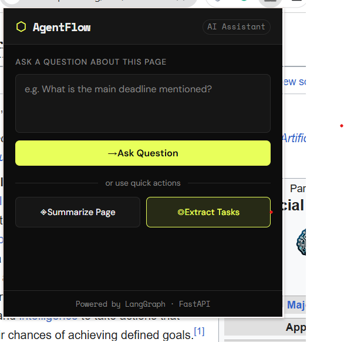
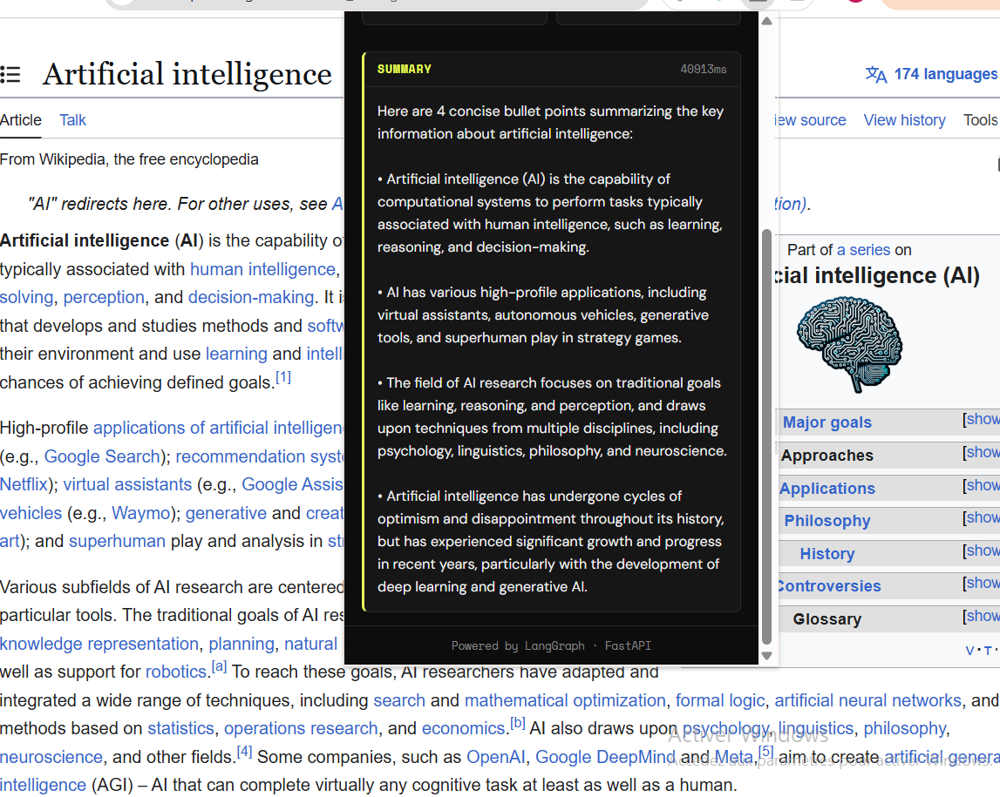

# ⬡ AgentFlow Assistant

> A Chrome extension + LangGraph backend that analyzes any web page using AI agents.
> Built as a demonstration of agentic AI workflows for structured information extraction.

---

## Project Overview

AgentFlow lets users **summarize pages**, **ask questions**, and **extract tasks** from any website through a Chrome extension popup.

The extension sends the current page content to a FastAPI backend, where a LangGraph router selects one of three specialized nodes:
- summarization
- question answering
- task extraction

The project demonstrates how LLM-powered workflows can be structured as an evaluatable multi-node pipeline instead of a single prompt call.

---

## Tech Stack

| Layer | Technology |
|-------|-----------|
| Frontend | React 18 · TypeScript · Vite · Chrome Extension MV3 |
| Backend | FastAPI · Python |
| AI Orchestration | LangGraph |
| LLM | Ollama (local model) |
| Evaluation | Python · CSV |
| CI/CD | GitHub Actions |

---

## Architecture

```text
Chrome Extension (React popup)
         │
         │ POST /analyze
         ▼
   FastAPI Backend
         │
         ▼
   LangGraph Router
    ┌────┴────┐
    ▼    ▼    ▼
[Summarize][QA][Extract Tasks]
    └────┬────┘
         ▼
   Ollama Local LLM

--- 

## Screenshots

### Popup UI


### Result Example
